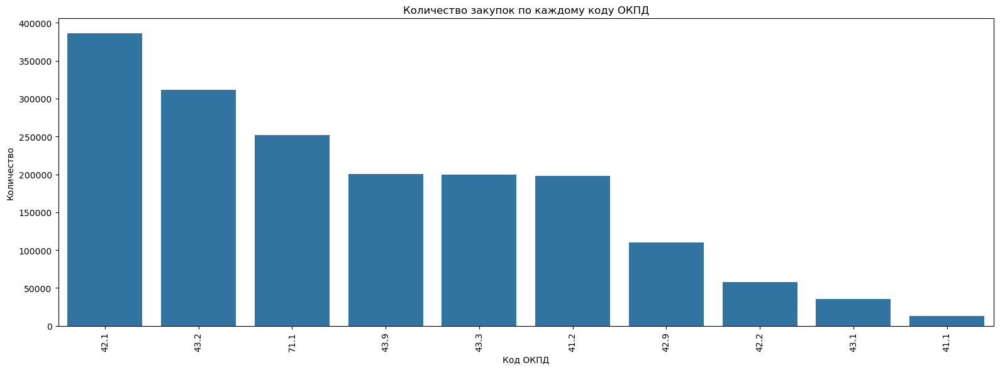
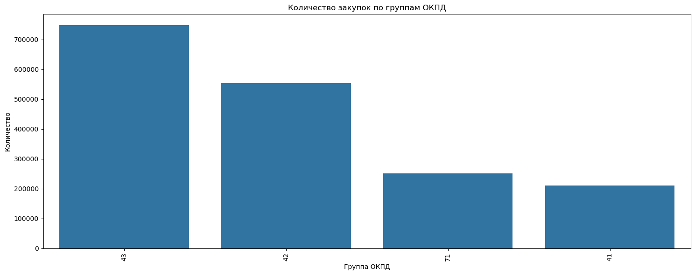

Выпускная квалификационная работа 
по курсу «Инженер данных Data engineer Pro

13393 Инженер данных PRO

НИКИТИНА МАРИНА ВАЛЕРЬЕВНА

Тема: 
Классификация госконтрактов по объектам закупки.


Задача: необходимо на основе данных с ftp.zakupki.gov.ru научиться определять группу, к которой относится контракт с кодом ОКПД-2 41, 42, 43, 71.1.
Группы могут быть следующим:

1.	Строительно-монтажные работы (СМР)
2.	Проектно-изыскательские работы (ПИР)
3.	Строительный надзор
4.	Подключение коммуникаций
5.	рочее.

По ОКПД-2 контракты в общем случае должны разделяться так:
Строительно-монтажные работы (СМР) - 41, 42, 43(кроме нижеперечисленных)
Проектно-изыскательские работы (ПИР) - 41.1, 71.1
Подключение коммуникаций - 43.22
Строительный надзор – четкогруппы нет.


Проблема: Далеко не всегда контракты указываются с нужным кодом, поэтому есть проблема как такие контракты "отловить" и определить  нужную группу.

Поэтому задача предполагает классификацию контрактов на основе объекта закупки, который сформулирован е
тественным языком. Также предполагаем, что могут иметь значение цена контракта и его длительность.
На основе этого на входе данные о контрактах. На выходе необходимо получить группу длякаждого контракта.

Иногда контракт может относиться одновремено в несколько групп.


Установка и подключение библиотек


```python
! pip install pandas
! pip install seaborn
```

    Requirement already satisfied: pandas in c:\programdata\anaconda3\lib\site-packages (2.2.2)
    Requirement already satisfied: numpy>=1.26.0 in c:\programdata\anaconda3\lib\site-packages (from pandas) (1.26.4)
    Requirement already satisfied: python-dateutil>=2.8.2 in c:\programdata\anaconda3\lib\site-packages (from pandas) (2.9.0.post0)
    Requirement already satisfied: pytz>=2020.1 in c:\programdata\anaconda3\lib\site-packages (from pandas) (2024.1)
    Requirement already satisfied: tzdata>=2022.7 in c:\programdata\anaconda3\lib\site-packages (from pandas) (2023.3)
    Requirement already satisfied: six>=1.5 in c:\programdata\anaconda3\lib\site-packages (from python-dateutil>=2.8.2->pandas) (1.16.0)
    Requirement already satisfied: seaborn in c:\programdata\anaconda3\lib\site-packages (0.13.2)
    Requirement already satisfied: numpy!=1.24.0,>=1.20 in c:\programdata\anaconda3\lib\site-packages (from seaborn) (1.26.4)
    Requirement already satisfied: pandas>=1.2 in c:\programdata\anaconda3\lib\site-packages (from seaborn) (2.2.2)
    Requirement already satisfied: matplotlib!=3.6.1,>=3.4 in c:\programdata\anaconda3\lib\site-packages (from seaborn) (3.9.2)
    Requirement already satisfied: contourpy>=1.0.1 in c:\programdata\anaconda3\lib\site-packages (from matplotlib!=3.6.1,>=3.4->seaborn) (1.2.0)
    Requirement already satisfied: cycler>=0.10 in c:\programdata\anaconda3\lib\site-packages (from matplotlib!=3.6.1,>=3.4->seaborn) (0.11.0)
    Requirement already satisfied: fonttools>=4.22.0 in c:\programdata\anaconda3\lib\site-packages (from matplotlib!=3.6.1,>=3.4->seaborn) (4.51.0)
    Requirement already satisfied: kiwisolver>=1.3.1 in c:\programdata\anaconda3\lib\site-packages (from matplotlib!=3.6.1,>=3.4->seaborn) (1.4.4)
    Requirement already satisfied: packaging>=20.0 in c:\programdata\anaconda3\lib\site-packages (from matplotlib!=3.6.1,>=3.4->seaborn) (24.1)
    Requirement already satisfied: pillow>=8 in c:\programdata\anaconda3\lib\site-packages (from matplotlib!=3.6.1,>=3.4->seaborn) (10.4.0)
    Requirement already satisfied: pyparsing>=2.3.1 in c:\programdata\anaconda3\lib\site-packages (from matplotlib!=3.6.1,>=3.4->seaborn) (3.1.2)
    Requirement already satisfied: python-dateutil>=2.7 in c:\programdata\anaconda3\lib\site-packages (from matplotlib!=3.6.1,>=3.4->seaborn) (2.9.0.post0)
    Requirement already satisfied: pytz>=2020.1 in c:\programdata\anaconda3\lib\site-packages (from pandas>=1.2->seaborn) (2024.1)
    Requirement already satisfied: tzdata>=2022.7 in c:\programdata\anaconda3\lib\site-packages (from pandas>=1.2->seaborn) (2023.3)
    Requirement already satisfied: six>=1.5 in c:\programdata\anaconda3\lib\site-packages (from python-dateutil>=2.7->matplotlib!=3.6.1,>=3.4->seaborn) (1.16.0)
    


```python
import pandas as pd
```


```python
import numpy as np
```


```python
import matplotlib.pyplot as plt
import os
import gdown
import zipfile
import warnings
```


```python
import nltk
import spacy
import joblib
```


```python
pip install xgboost
```

    Requirement already satisfied: xgboost in c:\programdata\anaconda3\lib\site-packages (2.1.2)
    Requirement already satisfied: numpy in c:\programdata\anaconda3\lib\site-packages (from xgboost) (1.26.4)
    Requirement already satisfied: scipy in c:\programdata\anaconda3\lib\site-packages (from xgboost) (1.13.1)
    Note: you may need to restart the kernel to use updated packages.
    


```python
from sklearn.feature_extraction.text import TfidfVectorizer
from sklearn.preprocessing import MultiLabelBinarizer, label_binarize
from sklearn.model_selection import train_test_split
from sklearn.linear_model import LogisticRegression
from sklearn.ensemble import RandomForestClassifier, GradientBoostingClassifier
from sklearn.svm import LinearSVC
from sklearn.naive_bayes import MultinomialNB
from xgboost import XGBClassifier
from sklearn.neural_network import MLPClassifier
from sklearn.multioutput import MultiOutputClassifier
from sklearn.multiclass import OneVsRestClassifier
from sklearn.calibration import CalibratedClassifierCV
from sklearn.pipeline import Pipeline
from sklearn.metrics import classification_report, roc_auc_score, accuracy_score, f1_score, roc_curve, auc
```

Отключение предупреждений


```python
warnings.filterwarnings('ignore')
```

Задача имени ZIP-файла со списком контрактов


```python
name_zip = 'fz.zip'
```

Скачивание ZIP-файла со списком контрактов (2,6 Гб)


```python
url = 'https://drive.google.com/file/d/1sRHx27O3NgTivrrQHdBdTAqxdCYNmARW/view?usp=sharing'
gdown.download(url, name_zip, quiet=False)
```

    Downloading...
    From: https://drive.google.com/file/d/1sRHx27O3NgTivrrQHdBdTAqxdCYNmARW/view?usp=sharing
    To: C:\Users\User\fz.zip
    92.2kB [00:00, 5.12MB/s]
    


    'fz.zip'


Распаковка ZIP-файла со списком контрактов, размер CSV-файла ~ 26 Гб


```python
with zipfile.ZipFile(name_zip, 'r') as zip_ref:
  zip_ref.extractall()
```


    ---------------------------------------------------------------------------

    BadZipFile                                Traceback (most recent call last)

    Cell In[11], line 1
    ----> 1 with zipfile.ZipFile(name_zip, 'r') as zip_ref:
          2   zip_ref.extractall()
    

    File C:\ProgramData\anaconda3\Lib\zipfile\__init__.py:1349, in ZipFile.__init__(self, file, mode, compression, allowZip64, compresslevel, strict_timestamps, metadata_encoding)
       1347 try:
       1348     if mode == 'r':
    -> 1349         self._RealGetContents()
       1350     elif mode in ('w', 'x'):
       1351         # set the modified flag so central directory gets written
       1352         # even if no files are added to the archive
       1353         self._didModify = True
    

    File C:\ProgramData\anaconda3\Lib\zipfile\__init__.py:1416, in ZipFile._RealGetContents(self)
       1414     raise BadZipFile("File is not a zip file")
       1415 if not endrec:
    -> 1416     raise BadZipFile("File is not a zip file")
       1417 if self.debug > 1:
       1418     print(endrec)
    

    BadZipFile: File is not a zip file


Проверка наличия CSV-файла в каталоге и присвоение имени 


```python
name_csv = None
for file in os.listdir():
  if file.endswith('.csv'):
    name_csv = file
    break

if name_csv is None:
  raise FileNotFoundError("В ZIP-архиве CSV-файл не найден")
```


```python
df_original = pd.DataFrame()
```

Определение типов записей, необходимых для анализа


```python
type_cols = {'contract_number': 'string', 'object_name': 'string', 'cost': 'string', 'object_code': 'string'}
```

Чтение данных из CSV-файла_больших_данных частями в датафрейм, параллельно удаляем столбцы и строки с пустыми значениями, примечания ниже 


```python
with pd.read_csv(name_csv, chunksize=100000, encoding='utf-8', on_bad_lines="skip", delimiter=',', header=None, usecols=[1, 11, 20, 26], names=['contract_number', 'object_name', 'cost', 'object_code'], dtype=type_cols) as reader:
  for chunk in reader:
    # Отфильтровываем записи о контрактах, оставляя записи групп ОКПД2 41, 42, 43, 71.1
    chunk = chunk[(chunk['object_code'].str.len() <= 4) & (chunk['object_code'].str.contains('^41.') | chunk['object_code'].str.contains('^42.') | chunk['object_code'].str.contains('^43.') | chunk['object_code'].str.contains('^71.1'))]
   # Удаляем из датафрейма строки с неопределенным предметом закупки и строки с пустыми значениями
    chunk = chunk.loc[chunk['object_name'] != '<НЕ ОПРЕДЕЛЕНО>']
    chunk.dropna
    # Добавляем текущий chunk в итоговый большой датафрейм
    df_original = pd.concat([df_original, chunk], ignore_index=True)
```

Создание и предварительный анализ рабочего датафрейма


```python
df_work = df_original
```

Сбрасывание индексов в нем


```python
df_work = df_work.reset_index()
del df_work['index']
```

Выборка 5 случайных записей


```python
df_work.sample(5)
```


<div>
<style scoped>
    .dataframe tbody tr th:only-of-type {
        vertical-align: middle;
    }

    .dataframe tbody tr th {
        vertical-align: top;
    }

    .dataframe thead th {
        text-align: right;
    }
</style>
<table border="1" class="dataframe">
  <thead>
    <tr style="text-align: right;">
      <th></th>
      <th>contract_number</th>
      <th>object_name</th>
      <th>cost</th>
      <th>object_code</th>
    </tr>
  </thead>
  <tbody>
    <tr>
      <th>1145938</th>
      <td>1540629709420000130</td>
      <td>Ремонт кровли</td>
      <td>262120.00</td>
      <td>43.9</td>
    </tr>
    <tr>
      <th>215491</th>
      <td>3760901395416000005</td>
      <td>Выполнение работ по ремонту туалетов 1,2 этажей</td>
      <td>505612.30</td>
      <td>43.2</td>
    </tr>
    <tr>
      <th>1672951</th>
      <td>1263204164722000115</td>
      <td>Авторский надзор на объекте: «Строительство и ...</td>
      <td>\N</td>
      <td>71.1</td>
    </tr>
    <tr>
      <th>1062529</th>
      <td>3471400364621000034</td>
      <td>выполнение работ по ремонту  эвакуационного вы...</td>
      <td>94350.00</td>
      <td>43.9</td>
    </tr>
    <tr>
      <th>1352936</th>
      <td>3261600453519000008</td>
      <td>Ремонт участка № 1 автомобильной дороги общего...</td>
      <td>5546107.00</td>
      <td>42.1</td>
    </tr>
  </tbody>
</table>
</div>


Размерность датафрейма


```python
df_work.shape
```


    (1764006, 4)


Типы данных датафрейма


```python
df_work.info()
```

    <class 'pandas.core.frame.DataFrame'>
    RangeIndex: 1764006 entries, 0 to 1764005
    Data columns (total 4 columns):
     #   Column           Dtype 
    ---  ------           ----- 
     0   contract_number  string
     1   object_name      string
     2   cost             string
     3   object_code      string
    dtypes: string(4)
    memory usage: 53.8 MB
    

Выборка первых 7 строк датафрейма


```python
df_work.head(7)
```


<div>
<style scoped>
    .dataframe tbody tr th:only-of-type {
        vertical-align: middle;
    }

    .dataframe tbody tr th {
        vertical-align: top;
    }

    .dataframe thead th {
        text-align: right;
    }
</style>
<table border="1" class="dataframe">
  <thead>
    <tr style="text-align: right;">
      <th></th>
      <th>contract_number</th>
      <th>object_name</th>
      <th>cost</th>
      <th>object_code</th>
    </tr>
  </thead>
  <tbody>
    <tr>
      <th>0</th>
      <td>1026802173421000064</td>
      <td>прочая закупка услуг (услуги по монтажу и пуск...</td>
      <td>277671.00</td>
      <td>43.2</td>
    </tr>
    <tr>
      <th>1</th>
      <td>1027401123721000132</td>
      <td>выполнение работ по текущему ремонту заполнени...</td>
      <td>723924.00</td>
      <td>43.3</td>
    </tr>
    <tr>
      <th>2</th>
      <td>1027401123721000133</td>
      <td>выполнение работ по текущему ремонту заполнени...</td>
      <td>318484.80</td>
      <td>43.3</td>
    </tr>
    <tr>
      <th>3</th>
      <td>1027401123721000134</td>
      <td>выполнение работ по текущему ремонту заполнени...</td>
      <td>1066988.40</td>
      <td>43.3</td>
    </tr>
    <tr>
      <th>4</th>
      <td>1027401123721000135</td>
      <td>выполнение работ по текущему ремонту заполнени...</td>
      <td>218724.00</td>
      <td>43.3</td>
    </tr>
    <tr>
      <th>5</th>
      <td>1027401123721000136</td>
      <td>выполнение работ по монтажу средств  тревожной...</td>
      <td>1682431.20</td>
      <td>43.2</td>
    </tr>
    <tr>
      <th>6</th>
      <td>1027401123721000145</td>
      <td>Поставка и работы по установке противопожарных...</td>
      <td>367466.67</td>
      <td>43.3</td>
    </tr>
  </tbody>
</table>
</div>


Проверка null-значений


```python
df_work.isna().sum()
```


    contract_number    0
    object_name        0
    cost               0
    object_code        0
    dtype: int64


Проверка на уникальные значения


```python
df_work.nunique()
```


    contract_number    1529994
    object_name        1245646
    cost               1123238
    object_code             10
    dtype: int64


Подсчет количества записей, сгруппированных по коду ОКПД-2


```python
df_work.groupby('object_code', as_index=False).agg({'object_name':'count'})
```


<div>
<style scoped>
    .dataframe tbody tr th:only-of-type {
        vertical-align: middle;
    }

    .dataframe tbody tr th {
        vertical-align: top;
    }

    .dataframe thead th {
        text-align: right;
    }
</style>
<table border="1" class="dataframe">
  <thead>
    <tr style="text-align: right;">
      <th></th>
      <th>object_code</th>
      <th>object_name</th>
    </tr>
  </thead>
  <tbody>
    <tr>
      <th>0</th>
      <td>41.1</td>
      <td>12708</td>
    </tr>
    <tr>
      <th>1</th>
      <td>41.2</td>
      <td>197730</td>
    </tr>
    <tr>
      <th>2</th>
      <td>42.1</td>
      <td>386497</td>
    </tr>
    <tr>
      <th>3</th>
      <td>42.2</td>
      <td>57455</td>
    </tr>
    <tr>
      <th>4</th>
      <td>42.9</td>
      <td>110079</td>
    </tr>
    <tr>
      <th>5</th>
      <td>43.1</td>
      <td>35840</td>
    </tr>
    <tr>
      <th>6</th>
      <td>43.2</td>
      <td>311580</td>
    </tr>
    <tr>
      <th>7</th>
      <td>43.3</td>
      <td>199705</td>
    </tr>
    <tr>
      <th>8</th>
      <td>43.9</td>
      <td>200305</td>
    </tr>
    <tr>
      <th>9</th>
      <td>71.1</td>
      <td>252107</td>
    </tr>
  </tbody>
</table>
</div>


переименуюсь-ка + проверка


```python
df = df_work
```


```python
df.shape
```


    (1764006, 4)


проверка успешна


```python
df.describe()
```


<div>
<style scoped>
    .dataframe tbody tr th:only-of-type {
        vertical-align: middle;
    }

    .dataframe tbody tr th {
        vertical-align: top;
    }

    .dataframe thead th {
        text-align: right;
    }
</style>
<table border="1" class="dataframe">
  <thead>
    <tr style="text-align: right;">
      <th></th>
      <th>contract_number</th>
      <th>object_name</th>
      <th>cost</th>
      <th>object_code</th>
    </tr>
  </thead>
  <tbody>
    <tr>
      <th>count</th>
      <td>1764006</td>
      <td>1764006</td>
      <td>1764006</td>
      <td>1764006</td>
    </tr>
    <tr>
      <th>unique</th>
      <td>1529994</td>
      <td>1245646</td>
      <td>1123238</td>
      <td>10</td>
    </tr>
    <tr>
      <th>top</th>
      <td>3434530185621000050</td>
      <td>Приобретение у застройщика жилого помещения (о...</td>
      <td>\N</td>
      <td>42.1</td>
    </tr>
    <tr>
      <th>freq</th>
      <td>238</td>
      <td>4271</td>
      <td>22549</td>
      <td>386497</td>
    </tr>
  </tbody>
</table>
</div>


```python
df
```


<div>
<style scoped>
    .dataframe tbody tr th:only-of-type {
        vertical-align: middle;
    }

    .dataframe tbody tr th {
        vertical-align: top;
    }

    .dataframe thead th {
        text-align: right;
    }
</style>
<table border="1" class="dataframe">
  <thead>
    <tr style="text-align: right;">
      <th></th>
      <th>contract_number</th>
      <th>object_name</th>
      <th>cost</th>
      <th>object_code</th>
    </tr>
  </thead>
  <tbody>
    <tr>
      <th>0</th>
      <td>1026802173421000064</td>
      <td>прочая закупка услуг (услуги по монтажу и пуск...</td>
      <td>277671.00</td>
      <td>43.2</td>
    </tr>
    <tr>
      <th>1</th>
      <td>1027401123721000132</td>
      <td>выполнение работ по текущему ремонту заполнени...</td>
      <td>723924.00</td>
      <td>43.3</td>
    </tr>
    <tr>
      <th>2</th>
      <td>1027401123721000133</td>
      <td>выполнение работ по текущему ремонту заполнени...</td>
      <td>318484.80</td>
      <td>43.3</td>
    </tr>
    <tr>
      <th>3</th>
      <td>1027401123721000134</td>
      <td>выполнение работ по текущему ремонту заполнени...</td>
      <td>1066988.40</td>
      <td>43.3</td>
    </tr>
    <tr>
      <th>4</th>
      <td>1027401123721000135</td>
      <td>выполнение работ по текущему ремонту заполнени...</td>
      <td>218724.00</td>
      <td>43.3</td>
    </tr>
    <tr>
      <th>...</th>
      <td>...</td>
      <td>...</td>
      <td>...</td>
      <td>...</td>
    </tr>
    <tr>
      <th>1764001</th>
      <td>3621501588022000002</td>
      <td>Благоустройство кладбища в с. Льгово</td>
      <td>1112408.40</td>
      <td>42.9</td>
    </tr>
    <tr>
      <th>1764002</th>
      <td>3621501588022000002</td>
      <td>Благоустройство кладбища в с. Льгово</td>
      <td>1112408.40</td>
      <td>42.9</td>
    </tr>
    <tr>
      <th>1764003</th>
      <td>2780114580422000034</td>
      <td>Разработка проектно-сметной документации по со...</td>
      <td>35154931.84</td>
      <td>71.1</td>
    </tr>
    <tr>
      <th>1764004</th>
      <td>2780114580422000035</td>
      <td>Разработка проектно-сметной документации по со...</td>
      <td>38450706.70</td>
      <td>71.1</td>
    </tr>
    <tr>
      <th>1764005</th>
      <td>2782534239021000055</td>
      <td>Разработка проектной документации на выполнени...</td>
      <td>19847970.77</td>
      <td>71.1</td>
    </tr>
  </tbody>
</table>
<p>1764006 rows × 4 columns</p>
</div>


Проверка дубликатов


```python
duplicated_registy_numbers = df[df['contract_number'].duplicated(keep=False)].sort_values(by='contract_number')
print(duplicated_registy_numbers[['contract_number','object_code']].head(20))

full_duplicates = duplicated_registy_numbers.duplicated(keep=False).sum()
partial_duplicates = len(duplicated_registy_numbers) - full_duplicates

print('Полных дупликатов:', full_duplicates)
print('Частичных дупликатов: ', partial_duplicates)
```

                 contract_number object_code
    597681   0340300119314000001        41.2
    597682   0340300119314000001        41.2
    52876    1010501691419000001        43.2
    52877    1010501691419000001        43.2
    796209   1010501746719000023        43.2
    796208   1010501746719000023        43.2
    1230986  1010501746719000059        43.2
    1230985  1010501746719000059        43.2
    361414   1010501763616000010        43.2
    361415   1010501763616000010        43.2
    1134219  1010501763617000007        43.2
    1134220  1010501763617000007        43.2
    185827   1010501790016000022        43.3
    185828   1010501790016000022        43.3
    1532300  1010501994721000040        41.2
    1532299  1010501994721000040        41.2
    1532539  1010502039621000026        41.2
    1532540  1010502039621000026        41.2
    361418   1010502822916000052        43.9
    361419   1010502822916000052        43.9
    Полных дупликатов: 404743
    Частичных дупликатов:  13436
    


```python
code_counts = df.groupby(['object_code', 'object_name']).size().reset_index(name='count')
code_counts
```


<div>
<style scoped>
    .dataframe tbody tr th:only-of-type {
        vertical-align: middle;
    }

    .dataframe tbody tr th {
        vertical-align: top;
    }

    .dataframe thead th {
        text-align: right;
    }
</style>
<table border="1" class="dataframe">
  <thead>
    <tr style="text-align: right;">
      <th></th>
      <th>object_code</th>
      <th>object_name</th>
      <th>count</th>
    </tr>
  </thead>
  <tbody>
    <tr>
      <th>0</th>
      <td>41.1</td>
      <td>«Выполнение инженерно-изыскательских ра...</td>
      <td>1</td>
    </tr>
    <tr>
      <th>1</th>
      <td>41.1</td>
      <td>Внесение  изменений в проектную и рабоч...</td>
      <td>1</td>
    </tr>
    <tr>
      <th>2</th>
      <td>41.1</td>
      <td>Выполнение проектно-изыскательских работ по о...</td>
      <td>1</td>
    </tr>
    <tr>
      <th>3</th>
      <td>41.1</td>
      <td>Проведение Государственной экспертизы проектн...</td>
      <td>1</td>
    </tr>
    <tr>
      <th>4</th>
      <td>41.1</td>
      <td>Разработка проектно-сметной документации по  ...</td>
      <td>1</td>
    </tr>
    <tr>
      <th>...</th>
      <td>...</td>
      <td>...</td>
      <td>...</td>
    </tr>
    <tr>
      <th>1264644</th>
      <td>71.1</td>
      <td>№ЭА-690/16 на определение поставщика (подрядчи...</td>
      <td>1</td>
    </tr>
    <tr>
      <th>1264645</th>
      <td>71.1</td>
      <td>№ЭА192/2016 На право заключения гражданско-пра...</td>
      <td>1</td>
    </tr>
    <tr>
      <th>1264646</th>
      <td>71.1</td>
      <td>№ЭА40177/19 \Оказание услуг по разработке и из...</td>
      <td>1</td>
    </tr>
    <tr>
      <th>1264647</th>
      <td>71.1</td>
      <td>№ЭА47400/19 «Выполнение работ по разработке пр...</td>
      <td>1</td>
    </tr>
    <tr>
      <th>1264648</th>
      <td>71.1</td>
      <td>№ЭА5012/16«Выполнение работ по разработке прое...</td>
      <td>1</td>
    </tr>
  </tbody>
</table>
<p>1264649 rows × 3 columns</p>
</div>


```python
grouped_data = df.groupby('object_code')['object_name'].nunique()

multiple_descriptions = grouped_data[grouped_data > 1]
multiple_descriptions
```


    object_code
    41.1     11194
    41.2    119133
    42.1    262167
    42.2     43178
    42.9     77735
    43.1     25805
    43.2    224835
    43.3    155596
    43.9    155240
    71.1    189766
    Name: object_name, dtype: int64


```python
df.duplicated().sum()
```


    224540


```python
df.sort_values(ascending=False, by='cost')
```


<div>
<style scoped>
    .dataframe tbody tr th:only-of-type {
        vertical-align: middle;
    }

    .dataframe tbody tr th {
        vertical-align: top;
    }

    .dataframe thead th {
        text-align: right;
    }
</style>
<table border="1" class="dataframe">
  <thead>
    <tr style="text-align: right;">
      <th></th>
      <th>contract_number</th>
      <th>object_name</th>
      <th>cost</th>
      <th>object_code</th>
    </tr>
  </thead>
  <tbody>
    <tr>
      <th>1639491</th>
      <td>3591601824521000004</td>
      <td>Исполнение контракта прекращено</td>
      <td>Соглашение сторон</td>
      <td>41.2</td>
    </tr>
    <tr>
      <th>1544674</th>
      <td>3310300280922000011</td>
      <td>Выполнение работ по объекту: \Устройство ограж...</td>
      <td>Соглашение сторон</td>
      <td>43.2</td>
    </tr>
    <tr>
      <th>1682568</th>
      <td>3702200564722000076</td>
      <td>Ремонт участка внутриквартального проезда в 7 ...</td>
      <td>Соглашение сторон</td>
      <td>42.1</td>
    </tr>
    <tr>
      <th>1534587</th>
      <td>3224400379322000002</td>
      <td>Выполнение работ по капитальному ремонту здани...</td>
      <td>Соглашение сторон</td>
      <td>41.2</td>
    </tr>
    <tr>
      <th>1589529</th>
      <td>3231509380622000115</td>
      <td>Проектные (изыскательские) работы \Проект благ...</td>
      <td>Соглашение сторон</td>
      <td>71.1</td>
    </tr>
    <tr>
      <th>...</th>
      <td>...</td>
      <td>...</td>
      <td>...</td>
      <td>...</td>
    </tr>
    <tr>
      <th>1115113</th>
      <td>3663900150618000026</td>
      <td>Демонтаж муниципальных объектов</td>
      <td>1.00</td>
      <td>43.1</td>
    </tr>
    <tr>
      <th>1300369</th>
      <td>3682002198619000004</td>
      <td>Работы строительные специализированные, в зоне...</td>
      <td>0.10</td>
      <td>43.9</td>
    </tr>
    <tr>
      <th>169331</th>
      <td>3236500450516000085</td>
      <td>Неотложные аварийно-восстановительные работы о...</td>
      <td>0.01</td>
      <td>42.1</td>
    </tr>
    <tr>
      <th>175211</th>
      <td>3650800240016000004</td>
      <td>Проведение аварийно-восстановительных работ в ...</td>
      <td>0.01</td>
      <td>43.9</td>
    </tr>
    <tr>
      <th>363804</th>
      <td>2032647372516000015</td>
      <td>Выполнение аварийно-восстановительных работ (л...</td>
      <td>0.01</td>
      <td>42.1</td>
    </tr>
  </tbody>
</table>
<p>1764006 rows × 4 columns</p>
</div>


Анализ кодов ОКПД2


```python
import matplotlib.pyplot as plt
import seaborn as sns
```


```python
plt.figure(figsize=(16, 6))
sns.countplot(data=df, x='object_code', order=df['object_code'].value_counts().index)
plt.title('Количество закупок по каждому коду ОКПД')
plt.xlabel('Код ОКПД')
plt.ylabel('Количество')
plt.xticks(rotation=90)
plt.tight_layout()
plt.show()
```


    

    


```python
df['code_int'] = df['object_code'].apply(lambda x: '.'.join(x.split('.')[:1]))

plt.figure(figsize=(15, 6))
sns.countplot(data=df, x='code_int', order=df['code_int'].value_counts().index)
plt.title('Количество закупок по группам ОКПД')
plt.xlabel('Группа ОКПД')
plt.ylabel('Количество')
plt.xticks(rotation=90)
plt.tight_layout()
plt.show()
```


    

    


```python
df.head(4)
```


<div>
<style scoped>
    .dataframe tbody tr th:only-of-type {
        vertical-align: middle;
    }

    .dataframe tbody tr th {
        vertical-align: top;
    }

    .dataframe thead th {
        text-align: right;
    }
</style>
<table border="1" class="dataframe">
  <thead>
    <tr style="text-align: right;">
      <th></th>
      <th>contract_number</th>
      <th>object_name</th>
      <th>cost</th>
      <th>object_code</th>
      <th>code_int</th>
    </tr>
  </thead>
  <tbody>
    <tr>
      <th>0</th>
      <td>1026802173421000064</td>
      <td>прочая закупка услуг (услуги по монтажу и пуск...</td>
      <td>277671.00</td>
      <td>43.2</td>
      <td>43</td>
    </tr>
    <tr>
      <th>1</th>
      <td>1027401123721000132</td>
      <td>выполнение работ по текущему ремонту заполнени...</td>
      <td>723924.00</td>
      <td>43.3</td>
      <td>43</td>
    </tr>
    <tr>
      <th>2</th>
      <td>1027401123721000133</td>
      <td>выполнение работ по текущему ремонту заполнени...</td>
      <td>318484.80</td>
      <td>43.3</td>
      <td>43</td>
    </tr>
    <tr>
      <th>3</th>
      <td>1027401123721000134</td>
      <td>выполнение работ по текущему ремонту заполнени...</td>
      <td>1066988.40</td>
      <td>43.3</td>
      <td>43</td>
    </tr>
  </tbody>
</table>
</div>


```python
grouped_data = df.groupby('object_code')['object_code'].unique()
grouped_data
```


    object_code
    41.1    [41.1]
    41.2    [41.2]
    42.1    [42.1]
    42.2    [42.2]
    42.9    [42.9]
    43.1    [43.1]
    43.2    [43.2]
    43.3    [43.3]
    43.9    [43.9]
    71.1    [71.1]
    Name: object_code, dtype: object


```python
query = '''object_code.str.contains("41.") or object_code.str.contains("42.") or object_code.str.contains("43.") or object_code == "71.1" '''
df = df.query(query, engine='python')
```


```python
df.describe()
```


<div>
<style scoped>
    .dataframe tbody tr th:only-of-type {
        vertical-align: middle;
    }

    .dataframe tbody tr th {
        vertical-align: top;
    }

    .dataframe thead th {
        text-align: right;
    }
</style>
<table border="1" class="dataframe">
  <thead>
    <tr style="text-align: right;">
      <th></th>
      <th>contract_number</th>
      <th>object_name</th>
      <th>cost</th>
      <th>object_code</th>
      <th>code_int</th>
    </tr>
  </thead>
  <tbody>
    <tr>
      <th>count</th>
      <td>1764006</td>
      <td>1764006</td>
      <td>1764006</td>
      <td>1764006</td>
      <td>1764006</td>
    </tr>
    <tr>
      <th>unique</th>
      <td>1529994</td>
      <td>1245646</td>
      <td>1123238</td>
      <td>10</td>
      <td>4</td>
    </tr>
    <tr>
      <th>top</th>
      <td>3434530185621000050</td>
      <td>Приобретение у застройщика жилого помещения (о...</td>
      <td>\N</td>
      <td>42.1</td>
      <td>43</td>
    </tr>
    <tr>
      <th>freq</th>
      <td>238</td>
      <td>4271</td>
      <td>22549</td>
      <td>386497</td>
      <td>747430</td>
    </tr>
  </tbody>
</table>
</div>


```python
df.head(4)
```


<div>
<style scoped>
    .dataframe tbody tr th:only-of-type {
        vertical-align: middle;
    }

    .dataframe tbody tr th {
        vertical-align: top;
    }

    .dataframe thead th {
        text-align: right;
    }
</style>
<table border="1" class="dataframe">
  <thead>
    <tr style="text-align: right;">
      <th></th>
      <th>contract_number</th>
      <th>object_name</th>
      <th>cost</th>
      <th>object_code</th>
      <th>code_int</th>
    </tr>
  </thead>
  <tbody>
    <tr>
      <th>0</th>
      <td>1026802173421000064</td>
      <td>прочая закупка услуг (услуги по монтажу и пуск...</td>
      <td>277671.00</td>
      <td>43.2</td>
      <td>43</td>
    </tr>
    <tr>
      <th>1</th>
      <td>1027401123721000132</td>
      <td>выполнение работ по текущему ремонту заполнени...</td>
      <td>723924.00</td>
      <td>43.3</td>
      <td>43</td>
    </tr>
    <tr>
      <th>2</th>
      <td>1027401123721000133</td>
      <td>выполнение работ по текущему ремонту заполнени...</td>
      <td>318484.80</td>
      <td>43.3</td>
      <td>43</td>
    </tr>
    <tr>
      <th>3</th>
      <td>1027401123721000134</td>
      <td>выполнение работ по текущему ремонту заполнени...</td>
      <td>1066988.40</td>
      <td>43.3</td>
      <td>43</td>
    </tr>
  </tbody>
</table>
</div>


Укорачиваю датафрейм для скорости


```python
n = 150000
df = df.sample(n)
```


```python
df.describe()
```


<div>
<style scoped>
    .dataframe tbody tr th:only-of-type {
        vertical-align: middle;
    }

    .dataframe tbody tr th {
        vertical-align: top;
    }

    .dataframe thead th {
        text-align: right;
    }
</style>
<table border="1" class="dataframe">
  <thead>
    <tr style="text-align: right;">
      <th></th>
      <th>contract_number</th>
      <th>object_name</th>
      <th>cost</th>
      <th>object_code</th>
      <th>code_int</th>
    </tr>
  </thead>
  <tbody>
    <tr>
      <th>count</th>
      <td>150000</td>
      <td>150000</td>
      <td>150000</td>
      <td>150000</td>
      <td>150000</td>
    </tr>
    <tr>
      <th>unique</th>
      <td>147706</td>
      <td>133919</td>
      <td>123266</td>
      <td>10</td>
      <td>4</td>
    </tr>
    <tr>
      <th>top</th>
      <td>3434530185621000050</td>
      <td>Приобретение у застройщика жилого помещения (о...</td>
      <td>\N</td>
      <td>42.1</td>
      <td>43</td>
    </tr>
    <tr>
      <th>freq</th>
      <td>24</td>
      <td>383</td>
      <td>2009</td>
      <td>32616</td>
      <td>63713</td>
    </tr>
  </tbody>
</table>
</div>


```python
! pip install scikit-learn
! pip install nltk
! pip install pymorphy2
! pip install requests
! pip install gensim
! pip install pymystem3
! pip install matplotlib
```

    Requirement already satisfied: scikit-learn in c:\programdata\anaconda3\lib\site-packages (1.5.1)
    Requirement already satisfied: numpy>=1.19.5 in c:\programdata\anaconda3\lib\site-packages (from scikit-learn) (1.26.4)
    Requirement already satisfied: scipy>=1.6.0 in c:\programdata\anaconda3\lib\site-packages (from scikit-learn) (1.13.1)
    Requirement already satisfied: joblib>=1.2.0 in c:\programdata\anaconda3\lib\site-packages (from scikit-learn) (1.4.2)
    Requirement already satisfied: threadpoolctl>=3.1.0 in c:\programdata\anaconda3\lib\site-packages (from scikit-learn) (3.5.0)
    Requirement already satisfied: nltk in c:\programdata\anaconda3\lib\site-packages (3.9.1)
    Requirement already satisfied: click in c:\programdata\anaconda3\lib\site-packages (from nltk) (8.1.7)
    Requirement already satisfied: joblib in c:\programdata\anaconda3\lib\site-packages (from nltk) (1.4.2)
    Requirement already satisfied: regex>=2021.8.3 in c:\programdata\anaconda3\lib\site-packages (from nltk) (2024.9.11)
    Requirement already satisfied: tqdm in c:\programdata\anaconda3\lib\site-packages (from nltk) (4.66.5)
    Requirement already satisfied: colorama in c:\programdata\anaconda3\lib\site-packages (from click->nltk) (0.4.6)
    Requirement already satisfied: pymorphy2 in c:\programdata\anaconda3\lib\site-packages (0.9.1)
    Requirement already satisfied: dawg-python>=0.7.1 in c:\programdata\anaconda3\lib\site-packages (from pymorphy2) (0.7.2)
    Requirement already satisfied: pymorphy2-dicts-ru<3.0,>=2.4 in c:\programdata\anaconda3\lib\site-packages (from pymorphy2) (2.4.417127.4579844)
    Requirement already satisfied: docopt>=0.6 in c:\programdata\anaconda3\lib\site-packages (from pymorphy2) (0.6.2)
    Requirement already satisfied: requests in c:\programdata\anaconda3\lib\site-packages (2.32.3)
    Requirement already satisfied: charset-normalizer<4,>=2 in c:\programdata\anaconda3\lib\site-packages (from requests) (3.3.2)
    Requirement already satisfied: idna<4,>=2.5 in c:\programdata\anaconda3\lib\site-packages (from requests) (3.7)
    Requirement already satisfied: urllib3<3,>=1.21.1 in c:\programdata\anaconda3\lib\site-packages (from requests) (2.2.3)
    Requirement already satisfied: certifi>=2017.4.17 in c:\programdata\anaconda3\lib\site-packages (from requests) (2024.8.30)
    Requirement already satisfied: gensim in c:\programdata\anaconda3\lib\site-packages (4.3.3)
    Requirement already satisfied: numpy<2.0,>=1.18.5 in c:\programdata\anaconda3\lib\site-packages (from gensim) (1.26.4)
    Requirement already satisfied: scipy<1.14.0,>=1.7.0 in c:\programdata\anaconda3\lib\site-packages (from gensim) (1.13.1)
    Requirement already satisfied: smart-open>=1.8.1 in c:\programdata\anaconda3\lib\site-packages (from gensim) (5.2.1)
    Requirement already satisfied: pymystem3 in c:\programdata\anaconda3\lib\site-packages (0.2.0)
    Requirement already satisfied: requests in c:\programdata\anaconda3\lib\site-packages (from pymystem3) (2.32.3)
    Requirement already satisfied: charset-normalizer<4,>=2 in c:\programdata\anaconda3\lib\site-packages (from requests->pymystem3) (3.3.2)
    Requirement already satisfied: idna<4,>=2.5 in c:\programdata\anaconda3\lib\site-packages (from requests->pymystem3) (3.7)
    Requirement already satisfied: urllib3<3,>=1.21.1 in c:\programdata\anaconda3\lib\site-packages (from requests->pymystem3) (2.2.3)
    Requirement already satisfied: certifi>=2017.4.17 in c:\programdata\anaconda3\lib\site-packages (from requests->pymystem3) (2024.8.30)
    Requirement already satisfied: matplotlib in c:\programdata\anaconda3\lib\site-packages (3.9.2)
    Requirement already satisfied: contourpy>=1.0.1 in c:\programdata\anaconda3\lib\site-packages (from matplotlib) (1.2.0)
    Requirement already satisfied: cycler>=0.10 in c:\programdata\anaconda3\lib\site-packages (from matplotlib) (0.11.0)
    Requirement already satisfied: fonttools>=4.22.0 in c:\programdata\anaconda3\lib\site-packages (from matplotlib) (4.51.0)
    Requirement already satisfied: kiwisolver>=1.3.1 in c:\programdata\anaconda3\lib\site-packages (from matplotlib) (1.4.4)
    Requirement already satisfied: numpy>=1.23 in c:\programdata\anaconda3\lib\site-packages (from matplotlib) (1.26.4)
    Requirement already satisfied: packaging>=20.0 in c:\programdata\anaconda3\lib\site-packages (from matplotlib) (24.1)
    Requirement already satisfied: pillow>=8 in c:\programdata\anaconda3\lib\site-packages (from matplotlib) (10.4.0)
    Requirement already satisfied: pyparsing>=2.3.1 in c:\programdata\anaconda3\lib\site-packages (from matplotlib) (3.1.2)
    Requirement already satisfied: python-dateutil>=2.7 in c:\programdata\anaconda3\lib\site-packages (from matplotlib) (2.9.0.post0)
    Requirement already satisfied: six>=1.5 in c:\programdata\anaconda3\lib\site-packages (from python-dateutil>=2.7->matplotlib) (1.16.0)
    


```python
import pandas as pd
import numpy as np
```

Чистим от чисел и латиницы


```python
def clear_text(text):
    lst = [char for char in text if 1039 < ord(text[0])]
    return ''.join(lst)
```


```python
df['object_name'] = df['object_name'].apply(lambda x: clear_text(x))
df = df[df["object_name"] != ""]
```


```python
df.sample(3)
```


<div>
<style scoped>
    .dataframe tbody tr th:only-of-type {
        vertical-align: middle;
    }

    .dataframe tbody tr th {
        vertical-align: top;
    }

    .dataframe thead th {
        text-align: right;
    }
</style>
<table border="1" class="dataframe">
  <thead>
    <tr style="text-align: right;">
      <th></th>
      <th>contract_number</th>
      <th>object_name</th>
      <th>cost</th>
      <th>object_code</th>
      <th>code_int</th>
    </tr>
  </thead>
  <tbody>
    <tr>
      <th>1405464</th>
      <td>3301702225518000005</td>
      <td>Выполнение работ по ремонту крыльца, дорожки и...</td>
      <td>605816.72</td>
      <td>43.9</td>
      <td>43</td>
    </tr>
    <tr>
      <th>1055586</th>
      <td>2290106893921000030</td>
      <td>Текущий ремонт  автоматической установки пожар...</td>
      <td>3159516.78</td>
      <td>43.2</td>
      <td>43</td>
    </tr>
    <tr>
      <th>1082858</th>
      <td>3471002623319000011</td>
      <td>Создание мест (площадок) накопления твердых ко...</td>
      <td>3309899.35</td>
      <td>42.9</td>
      <td>42</td>
    </tr>
  </tbody>
</table>
</div>


```python
df.describe()
```


<div>
<style scoped>
    .dataframe tbody tr th:only-of-type {
        vertical-align: middle;
    }

    .dataframe tbody tr th {
        vertical-align: top;
    }

    .dataframe thead th {
        text-align: right;
    }
</style>
<table border="1" class="dataframe">
  <thead>
    <tr style="text-align: right;">
      <th></th>
      <th>contract_number</th>
      <th>object_name</th>
      <th>cost</th>
      <th>object_code</th>
      <th>code_int</th>
    </tr>
  </thead>
  <tbody>
    <tr>
      <th>count</th>
      <td>147806</td>
      <td>147806</td>
      <td>147806</td>
      <td>147806</td>
      <td>147806</td>
    </tr>
    <tr>
      <th>unique</th>
      <td>145552</td>
      <td>131913</td>
      <td>121436</td>
      <td>10</td>
      <td>4</td>
    </tr>
    <tr>
      <th>top</th>
      <td>3434530185621000050</td>
      <td>Приобретение у застройщика жилого помещения (о...</td>
      <td>\N</td>
      <td>42.1</td>
      <td>43</td>
    </tr>
    <tr>
      <th>freq</th>
      <td>24</td>
      <td>383</td>
      <td>1986</td>
      <td>32140</td>
      <td>62732</td>
    </tr>
  </tbody>
</table>
</div>


Токенизация, лемматизация, очистка пунктуации и от стоп-слов


```python
import pandas as pd
import numpy as np
import matplotlib.pyplot as plt
import matplotlib.ticker as ticker
import seaborn as sns

from nltk.tokenize import sent_tokenize, word_tokenize
from nltk import download
from nltk.tokenize import word_tokenize
from nltk import pos_tag
from nltk.corpus import stopwords
from nltk.stem import WordNetLemmatizer
from nltk.corpus import wordnet as wn  # Проверить необходимость

from sklearn.preprocessing import MinMaxScaler
from sklearn.feature_extraction.text import TfidfVectorizer, CountVectorizer
from sklearn import model_selection, naive_bayes, svm
from sklearn.metrics import precision_score, f1_score
from sklearn.model_selection import train_test_split
from sklearn.linear_model import SGDClassifier  # SVM модель
from sklearn.naive_bayes import GaussianNB, MultinomialNB
from sklearn.tree import DecisionTreeClassifier
from sklearn.ensemble import AdaBoostClassifier

from gensim.models import Word2Vec
from collections import defaultdict, Counter
import openpyxl
```


```python
import nltk
nltk.download('punkt')
nltk.download('wordnet')
nltk.download('omw-1.4')
nltk.download('averaged_perceptron_tagger')
nltk.download('stopwords')
```

    [nltk_data] Downloading package punkt to
    [nltk_data]     C:\Users\User\AppData\Roaming\nltk_data...
    [nltk_data]   Package punkt is already up-to-date!
    [nltk_data] Downloading package wordnet to
    [nltk_data]     C:\Users\User\AppData\Roaming\nltk_data...
    [nltk_data]   Package wordnet is already up-to-date!
    [nltk_data] Downloading package omw-1.4 to
    [nltk_data]     C:\Users\User\AppData\Roaming\nltk_data...
    [nltk_data]   Package omw-1.4 is already up-to-date!
    [nltk_data] Downloading package averaged_perceptron_tagger to
    [nltk_data]     C:\Users\User\AppData\Roaming\nltk_data...
    [nltk_data]   Package averaged_perceptron_tagger is already up-to-
    [nltk_data]       date!
    [nltk_data] Downloading package stopwords to
    [nltk_data]     C:\Users\User\AppData\Roaming\nltk_data...
    [nltk_data]   Package stopwords is already up-to-date!
    


    True


```python
from nltk import download
from nltk.tokenize import word_tokenize
from nltk import pos_tag
from nltk.corpus import stopwords
from nltk.stem import WordNetLemmatizer
from collections import defaultdict, Counter
from nltk.corpus import wordnet as wn  # Проверить необходимость
from nltk.corpus import stopwords

#print(stopwords.words('russian'))

tag_map = defaultdict(lambda : wn.NOUN)
tag_map['J'] = wn.ADJ
tag_map['V'] = wn.VERB
tag_map['R'] = wn.ADV

stemmer = nltk.stem.snowball.RussianStemmer()
word_lemmatized = WordNetLemmatizer()


class NLP:
  
  def __init__(self, __df):
     self.df = __df

  def tokening(self):
     self.df['data'] =  [word_tokenize(entry.lower()) for entry in self.df['object_name']]

  def lammatize(self, word, tag):
     return word_lemmatized.lemmatize(word, tag_map[tag])

  def steming(self, word_final):
     return stemmer.stem(word_final)

  def fit(self): 
    self.tokening()
    for index, entry in zip(self.df["data"].index, self.df['data']):
        final_words = []
        for word, tag in pos_tag(entry):
            if word not in stopwords.words("russian") and word.isalpha():
                word_final = self.lammatize(word, tag[0])
                word_final = self.steming(word_final)
                final_words.append(word_final)
        self.df.loc[index, "data_final"] = str(final_words)
    return self.df

nlp = NLP(df)
df_final = nlp.fit()
```


```python
df_final.head(3)
```


<div>
<style scoped>
    .dataframe tbody tr th:only-of-type {
        vertical-align: middle;
    }

    .dataframe tbody tr th {
        vertical-align: top;
    }

    .dataframe thead th {
        text-align: right;
    }
</style>
<table border="1" class="dataframe">
  <thead>
    <tr style="text-align: right;">
      <th></th>
      <th>contract_number</th>
      <th>object_name</th>
      <th>cost</th>
      <th>object_code</th>
      <th>code_int</th>
      <th>data</th>
      <th>data_final</th>
    </tr>
  </thead>
  <tbody>
    <tr>
      <th>1736741</th>
      <td>3232800558922000559</td>
      <td>Приобретение объекта недвижимого имущества в г...</td>
      <td>3956666.66</td>
      <td>41.2</td>
      <td>41</td>
      <td>[приобретение, объекта, недвижимого, имущества...</td>
      <td>['приобретен', 'объект', 'недвижим', 'имуществ...</td>
    </tr>
    <tr>
      <th>856093</th>
      <td>3671000424020000004</td>
      <td>Выполнение работ по восстановлению Братской мо...</td>
      <td>508315.20</td>
      <td>43.9</td>
      <td>43</td>
      <td>[выполнение, работ, по, восстановлению, братск...</td>
      <td>['выполнен', 'работ', 'восстановлен', 'братск'...</td>
    </tr>
    <tr>
      <th>1175974</th>
      <td>2860600285017000083</td>
      <td>Выполнение работ по текущему ремонту системы о...</td>
      <td>195443.40</td>
      <td>43.2</td>
      <td>43</td>
      <td>[выполнение, работ, по, текущему, ремонту, сис...</td>
      <td>['выполнен', 'работ', 'текущ', 'ремонт', 'сист...</td>
    </tr>
  </tbody>
</table>
</div>


ZZZZZZZZZZZZZZZZZZZZZZZZZZZZZZZZZZZZZZZZZZZZZZZZZZZZZZZZZZZZZZZZZZZZZZZZZZZZZz


```python
df = df.dropna()
data, object_code, data_final = df["data"], df["object_code"], df["data_final"]
```


```python
df
```


<div>
<style scoped>
    .dataframe tbody tr th:only-of-type {
        vertical-align: middle;
    }

    .dataframe tbody tr th {
        vertical-align: top;
    }

    .dataframe thead th {
        text-align: right;
    }
</style>
<table border="1" class="dataframe">
  <thead>
    <tr style="text-align: right;">
      <th></th>
      <th>contract_number</th>
      <th>object_name</th>
      <th>cost</th>
      <th>object_code</th>
      <th>code_int</th>
      <th>data</th>
      <th>data_final</th>
    </tr>
  </thead>
  <tbody>
    <tr>
      <th>1736741</th>
      <td>3232800558922000559</td>
      <td>Приобретение объекта недвижимого имущества в г...</td>
      <td>3956666.66</td>
      <td>41.2</td>
      <td>41</td>
      <td>[приобретение, объекта, недвижимого, имущества...</td>
      <td>['приобретен', 'объект', 'недвижим', 'имуществ...</td>
    </tr>
    <tr>
      <th>856093</th>
      <td>3671000424020000004</td>
      <td>Выполнение работ по восстановлению Братской мо...</td>
      <td>508315.20</td>
      <td>43.9</td>
      <td>43</td>
      <td>[выполнение, работ, по, восстановлению, братск...</td>
      <td>['выполнен', 'работ', 'восстановлен', 'братск'...</td>
    </tr>
    <tr>
      <th>1175974</th>
      <td>2860600285017000083</td>
      <td>Выполнение работ по текущему ремонту системы о...</td>
      <td>195443.40</td>
      <td>43.2</td>
      <td>43</td>
      <td>[выполнение, работ, по, текущему, ремонту, сис...</td>
      <td>['выполнен', 'работ', 'текущ', 'ремонт', 'сист...</td>
    </tr>
    <tr>
      <th>741089</th>
      <td>1770989550920002169</td>
      <td>Оказание услуг по техническому обслуживанию и ...</td>
      <td>256506.24</td>
      <td>43.2</td>
      <td>43</td>
      <td>[оказание, услуг, по, техническому, обслуживан...</td>
      <td>['оказан', 'услуг', 'техническ', 'обслуживан',...</td>
    </tr>
    <tr>
      <th>1629119</th>
      <td>3531200105522000049</td>
      <td>Выполнение работ по ремонту участка автомобиль...</td>
      <td>1809025.00</td>
      <td>42.1</td>
      <td>42</td>
      <td>[выполнение, работ, по, ремонту, участка, авто...</td>
      <td>['выполнен', 'работ', 'ремонт', 'участк', 'авт...</td>
    </tr>
    <tr>
      <th>...</th>
      <td>...</td>
      <td>...</td>
      <td>...</td>
      <td>...</td>
      <td>...</td>
      <td>...</td>
      <td>...</td>
    </tr>
    <tr>
      <th>121713</th>
      <td>2632000440719000112</td>
      <td>Выполнение работ по текущему ремонту помещений...</td>
      <td>1699927.82</td>
      <td>43.3</td>
      <td>43</td>
      <td>[выполнение, работ, по, текущему, ремонту, пом...</td>
      <td>['выполнен', 'работ', 'текущ', 'ремонт', 'поме...</td>
    </tr>
    <tr>
      <th>941576</th>
      <td>2772231528120000007</td>
      <td>Выполнение работ по устройству навеса для базы...</td>
      <td>1000000.00</td>
      <td>41.2</td>
      <td>41</td>
      <td>[выполнение, работ, по, устройству, навеса, дл...</td>
      <td>['выполнен', 'работ', 'устройств', 'навес', 'б...</td>
    </tr>
    <tr>
      <th>1032381</th>
      <td>2410105990717000126</td>
      <td>выполнение работ по текущему  ремонту душевой ...</td>
      <td>90340.00</td>
      <td>43.3</td>
      <td>43</td>
      <td>[выполнение, работ, по, текущему, ремонту, душ...</td>
      <td>['выполнен', 'работ', 'текущ', 'ремонт', 'душе...</td>
    </tr>
    <tr>
      <th>1056601</th>
      <td>2594803504221000314</td>
      <td>Выборочный ремонт здания ПЧ-70, расположенной ...</td>
      <td>1356270.00</td>
      <td>43.9</td>
      <td>43</td>
      <td>[выборочный, ремонт, здания, пч-70, ,, располо...</td>
      <td>['выборочн', 'ремонт', 'здан', 'расположен', '...</td>
    </tr>
    <tr>
      <th>1013738</th>
      <td>3222202596221000004</td>
      <td>Выполнение работ по благоустройству территории...</td>
      <td>5095890.00</td>
      <td>42.9</td>
      <td>42</td>
      <td>[выполнение, работ, по, благоустройству, терри...</td>
      <td>['выполнен', 'работ', 'благоустройств', 'терри...</td>
    </tr>
  </tbody>
</table>
<p>147806 rows × 7 columns</p>
</div>


```python
data
```


    1736741    [приобретение, объекта, недвижимого, имущества...
    856093     [выполнение, работ, по, восстановлению, братск...
    1175974    [выполнение, работ, по, текущему, ремонту, сис...
    741089     [оказание, услуг, по, техническому, обслуживан...
    1629119    [выполнение, работ, по, ремонту, участка, авто...
                                     ...                        
    121713     [выполнение, работ, по, текущему, ремонту, пом...
    941576     [выполнение, работ, по, устройству, навеса, дл...
    1032381    [выполнение, работ, по, текущему, ремонту, душ...
    1056601    [выборочный, ремонт, здания, пч-70, ,, располо...
    1013738    [выполнение, работ, по, благоустройству, терри...
    Name: data, Length: 147806, dtype: object


```python
object_code
```


    1736741    41.2
    856093     43.9
    1175974    43.2
    741089     43.2
    1629119    42.1
               ... 
    121713     43.3
    941576     41.2
    1032381    43.3
    1056601    43.9
    1013738    42.9
    Name: object_code, Length: 147806, dtype: string


```python
data_final
```


    1736741    ['приобретен', 'объект', 'недвижим', 'имуществ...
    856093     ['выполнен', 'работ', 'восстановлен', 'братск'...
    1175974    ['выполнен', 'работ', 'текущ', 'ремонт', 'сист...
    741089     ['оказан', 'услуг', 'техническ', 'обслуживан',...
    1629119    ['выполнен', 'работ', 'ремонт', 'участк', 'авт...
                                     ...                        
    121713     ['выполнен', 'работ', 'текущ', 'ремонт', 'поме...
    941576     ['выполнен', 'работ', 'устройств', 'навес', 'б...
    1032381    ['выполнен', 'работ', 'текущ', 'ремонт', 'душе...
    1056601    ['выборочн', 'ремонт', 'здан', 'расположен', '...
    1013738    ['выполнен', 'работ', 'благоустройств', 'терри...
    Name: data_final, Length: 147806, dtype: object


Создаем словарь групп ОКПД2


```python
# Создадим словарь кодов ОКПД2 и соответствующих им рубрик классификатора
OKPD2_to_Labels = {
    '41.1': 'Документация проектная для строительства',
    '41.2': 'Здания и работы по возведению зданий',
    '42.1': 'Дороги автомобильные и железные; строительные работы по строительству автомобильных дорог и железных дорог',
    '42.2': 'Сооружения и строительные работы по строительству инженерных коммуникаций',
    '42.9': 'Сооружения и строительные работы по строительству прочих гражданских сооружений',
    '43.1': 'Работы по сносу зданий и сооружений и по подготовке строительного участка',
    '43.2': 'Работы электромонтажные; работы по монтажу водопроводных и канализационных систем и прочие строительно-монтажные работы',
    '43.3': 'Работы завершающие и отделочные в зданиях и сооружениях',
    '43.9': 'Работы строительные специализированные прочие',
    '71.1': 'Услуги в области архитектуры; инженерно-технического проектирования и связанные технические консультативные услуги'
}
```


```python
# Определим функцию для преобразования кодов ОКПД2 в текстовые метки рубрик классификатора
def convert_OKPD2_to_text_labels(code_OKPD2):
  return [OKPD2_to_Labels.get(c) for c in str(code_OKPD2).split(',') if c in OKPD2_to_Labels]
```


```python
# Создадим словарь рубрик классификатора и соответствующих им кодов ОКПД2
Labels_to_OKPD2 = {v: k for k, v in OKPD2_to_Labels.items()}
```


```python
# Промаркируем датафрейм метками рубрик
df['text_Labels'] = df['object_code'].apply(convert_OKPD2_to_text_labels)
```


```python
df.head(13)
```


<div>
<style scoped>
    .dataframe tbody tr th:only-of-type {
        vertical-align: middle;
    }

    .dataframe tbody tr th {
        vertical-align: top;
    }

    .dataframe thead th {
        text-align: right;
    }
</style>
<table border="1" class="dataframe">
  <thead>
    <tr style="text-align: right;">
      <th></th>
      <th>contract_number</th>
      <th>object_name</th>
      <th>cost</th>
      <th>object_code</th>
      <th>code_int</th>
      <th>data</th>
      <th>data_final</th>
      <th>text_Labels</th>
    </tr>
  </thead>
  <tbody>
    <tr>
      <th>1736741</th>
      <td>3232800558922000559</td>
      <td>Приобретение объекта недвижимого имущества в г...</td>
      <td>3956666.66</td>
      <td>41.2</td>
      <td>41</td>
      <td>[приобретение, объекта, недвижимого, имущества...</td>
      <td>['приобретен', 'объект', 'недвижим', 'имуществ...</td>
      <td>[Здания и работы по возведению зданий]</td>
    </tr>
    <tr>
      <th>856093</th>
      <td>3671000424020000004</td>
      <td>Выполнение работ по восстановлению Братской мо...</td>
      <td>508315.20</td>
      <td>43.9</td>
      <td>43</td>
      <td>[выполнение, работ, по, восстановлению, братск...</td>
      <td>['выполнен', 'работ', 'восстановлен', 'братск'...</td>
      <td>[Работы строительные специализированные прочие]</td>
    </tr>
    <tr>
      <th>1175974</th>
      <td>2860600285017000083</td>
      <td>Выполнение работ по текущему ремонту системы о...</td>
      <td>195443.40</td>
      <td>43.2</td>
      <td>43</td>
      <td>[выполнение, работ, по, текущему, ремонту, сис...</td>
      <td>['выполнен', 'работ', 'текущ', 'ремонт', 'сист...</td>
      <td>[Работы электромонтажные; работы по монтажу во...</td>
    </tr>
    <tr>
      <th>741089</th>
      <td>1770989550920002169</td>
      <td>Оказание услуг по техническому обслуживанию и ...</td>
      <td>256506.24</td>
      <td>43.2</td>
      <td>43</td>
      <td>[оказание, услуг, по, техническому, обслуживан...</td>
      <td>['оказан', 'услуг', 'техническ', 'обслуживан',...</td>
      <td>[Работы электромонтажные; работы по монтажу во...</td>
    </tr>
    <tr>
      <th>1629119</th>
      <td>3531200105522000049</td>
      <td>Выполнение работ по ремонту участка автомобиль...</td>
      <td>1809025.00</td>
      <td>42.1</td>
      <td>42</td>
      <td>[выполнение, работ, по, ремонту, участка, авто...</td>
      <td>['выполнен', 'работ', 'ремонт', 'участк', 'авт...</td>
      <td>[Дороги автомобильные и железные; строительные...</td>
    </tr>
    <tr>
      <th>810284</th>
      <td>3182400171019000026</td>
      <td>№ зз-19018-19 Выполнение комплексных кадастров...</td>
      <td>178500.00</td>
      <td>71.1</td>
      <td>71</td>
      <td>[№, зз-19018-19, выполнение, комплексных, када...</td>
      <td>['выполнен', 'комплексн', 'кадастров', 'работ'...</td>
      <td>[Услуги в области архитектуры; инженерно-техни...</td>
    </tr>
    <tr>
      <th>902881</th>
      <td>3382100781219000017</td>
      <td>Работы по ремонту забора</td>
      <td>600000.00</td>
      <td>43.2</td>
      <td>43</td>
      <td>[работы, по, ремонту, забора]</td>
      <td>['работ', 'ремонт', 'забор']</td>
      <td>[Работы электромонтажные; работы по монтажу во...</td>
    </tr>
    <tr>
      <th>490627</th>
      <td>3434801069317000092</td>
      <td>Выполнение кадастровых работ</td>
      <td>28666.67</td>
      <td>71.1</td>
      <td>71</td>
      <td>[выполнение, кадастровых, работ]</td>
      <td>['выполнен', 'кадастров', 'работ']</td>
      <td>[Услуги в области архитектуры; инженерно-техни...</td>
    </tr>
    <tr>
      <th>70806</th>
      <td>2770327661518000017</td>
      <td>Выполнение проектно-изыскательских работ по об...</td>
      <td>19480250.58</td>
      <td>71.1</td>
      <td>71</td>
      <td>[выполнение, проектно-изыскательских, работ, п...</td>
      <td>['выполнен', 'работ', 'объект', 'капитальн', '...</td>
      <td>[Услуги в области архитектуры; инженерно-техни...</td>
    </tr>
    <tr>
      <th>74615</th>
      <td>3380700027617000159</td>
      <td>Выполнение работ по разработке проектно-сметно...</td>
      <td>4412373.00</td>
      <td>71.1</td>
      <td>71</td>
      <td>[выполнение, работ, по, разработке, проектно-с...</td>
      <td>['выполнен', 'работ', 'разработк', 'документац...</td>
      <td>[Услуги в области архитектуры; инженерно-техни...</td>
    </tr>
    <tr>
      <th>372795</th>
      <td>1772905090116000044</td>
      <td>выборочный капитальный ремонт внутреннего двор...</td>
      <td>1118241.00</td>
      <td>43.3</td>
      <td>43</td>
      <td>[выборочный, капитальный, ремонт, внутреннего,...</td>
      <td>['выборочн', 'капитальн', 'ремонт', 'внутрен',...</td>
      <td>[Работы завершающие и отделочные в зданиях и с...</td>
    </tr>
    <tr>
      <th>186526</th>
      <td>1183103242016000077</td>
      <td>Выполнение работ по капитальному ремонту объек...</td>
      <td>84847.77</td>
      <td>43.9</td>
      <td>43</td>
      <td>[выполнение, работ, по, капитальному, ремонту,...</td>
      <td>['выполнен', 'работ', 'капитальн', 'ремонт', '...</td>
      <td>[Работы строительные специализированные прочие]</td>
    </tr>
    <tr>
      <th>314407</th>
      <td>3710604694617000030</td>
      <td>выполнение работ по ремонту рулонной кровли; р...</td>
      <td>2371349.86</td>
      <td>43.9</td>
      <td>43</td>
      <td>[выполнение, работ, по, ремонту, рулонной, кро...</td>
      <td>['выполнен', 'работ', 'ремонт', 'рулон', 'кров...</td>
      <td>[Работы строительные специализированные прочие]</td>
    </tr>
  </tbody>
</table>
</div>


```python
# Для многоклассовой классификации используем бинарное представление текстовых меток рубрик
mlb_Labels = MultiLabelBinarizer()
y = mlb_Labels.fit_transform(df['text_Labels'])
```


```python
y
```


    array([[0, 0, 1, ..., 0, 0, 0],
           [0, 0, 0, ..., 0, 0, 0],
           [0, 0, 0, ..., 0, 0, 0],
           ...,
           [0, 0, 0, ..., 0, 0, 0],
           [0, 0, 0, ..., 0, 0, 0],
           [0, 0, 0, ..., 0, 1, 0]])


```python
# Зададим размер обучающей выборки в 80%, тестовой выборки - 20%
X_train, X_test, y_train, y_test = train_test_split(df['data_final'], y, test_size=0.2, random_state=42)
```


```python
import pandas as pd
import numpy as np
import matplotlib.pyplot as plt
import matplotlib.ticker as ticker
import seaborn as sns

from nltk.tokenize import sent_tokenize, word_tokenize
from nltk import download
from nltk.tokenize import word_tokenize
from nltk import pos_tag
from nltk.corpus import stopwords
from nltk.stem import WordNetLemmatizer
from nltk.corpus import wordnet as wn  # Проверить необходимость

from sklearn.preprocessing import MinMaxScaler
from sklearn.feature_extraction.text import TfidfVectorizer, CountVectorizer
from sklearn import model_selection, naive_bayes, svm
from sklearn.metrics import precision_score, f1_score
from sklearn.model_selection import train_test_split
from sklearn.linear_model import SGDClassifier  # SVM модель
from sklearn.naive_bayes import GaussianNB, MultinomialNB
from sklearn.tree import DecisionTreeClassifier
from sklearn.ensemble import AdaBoostClassifier

from gensim.models import Word2Vec
from collections import defaultdict, Counter
import openpyxl
```


```python
import nltk
nltk.download('punkt')
nltk.download('wordnet')
nltk.download('omw-1.4')
nltk.download('averaged_perceptron_tagger')
nltk.download('stopwords')
```

    [nltk_data] Downloading package punkt to
    [nltk_data]     C:\Users\User\AppData\Roaming\nltk_data...
    [nltk_data]   Package punkt is already up-to-date!
    [nltk_data] Downloading package wordnet to
    [nltk_data]     C:\Users\User\AppData\Roaming\nltk_data...
    [nltk_data]   Package wordnet is already up-to-date!
    [nltk_data] Downloading package omw-1.4 to
    [nltk_data]     C:\Users\User\AppData\Roaming\nltk_data...
    [nltk_data]   Package omw-1.4 is already up-to-date!
    [nltk_data] Downloading package averaged_perceptron_tagger to
    [nltk_data]     C:\Users\User\AppData\Roaming\nltk_data...
    [nltk_data]   Package averaged_perceptron_tagger is already up-to-
    [nltk_data]       date!
    [nltk_data] Downloading package stopwords to
    [nltk_data]     C:\Users\User\AppData\Roaming\nltk_data...
    [nltk_data]   Package stopwords is already up-to-date!
    


    True


```python
tfidf = TfidfVectorizer(max_features=1700, min_df=5, max_df=0.7, stop_words=stopwords.words('russian'))
tfidf_X = tfidf.fit_transform(data_final).toarray()
tfidf_X_train, tfidf_X_test, tfidf_y_train, tfidf_y_test = train_test_split(tfidf_X,
                                                                            y,
                                                                            test_size=0.2,
                                                                            random_state=0)
```

Метод логистической регрессии. На выборке 150 тысяч записей модель обучается около минуты


```python
model = MultiOutputClassifier(LogisticRegression(max_iter=1000))
```

Сслучайный лес. На выборке 150 тысяч записей модель обучается за 1 час 15 минут# model = MultiOutputClassifier(RandomForestClassifier(n_estimators=100, random_state=42)Гм градиентный бустинг. На выборке 150 тысяч записей модель обучается за 18 мин
# model = MultiOutputClassifier(GradientBoostingClassifier(n_estimators=100, random_state=4Муем метод опорных векторов. На выборке 150 тысяч записей модель обучается около миты
# model = OneVsRestClassifier(CalibratedClassifierCV(LinearSVНьзуем наивный байесовский классификатор. На выборке 150 тысяч записей модель обучается за несколько кунд
# model = OneVsRestClassifier(Multinomiпользуем XGBoost. На выборке 150 тысяч записей модель обучается за 3,минуты
# model = MultiOutputClassifier(XGBClassifier(n_estimators=100, random_sНспользуем нейронные сети. На выборке 150 тысяч записей модель обучается оло часа
# model = MultiOutputClassifier(MLPClassifier(hidden_layer_sizes=(10), max_iter=100, random_state=42))


```python
# Построим пайплайн модели обучения
pipeline = Pipeline([
    ('tfidf', tfidf),
    ('clsf', model)
])
```


```python
pipeline.fit(X_train, y_train)
```


<style>#sk-container-id-1 {
  /* Definition of color scheme common for light and dark mode */
  --sklearn-color-text: black;
  --sklearn-color-line: gray;
  /* Definition of color scheme for unfitted estimators */
  --sklearn-color-unfitted-level-0: #fff5e6;
  --sklearn-color-unfitted-level-1: #f6e4d2;
  --sklearn-color-unfitted-level-2: #ffe0b3;
  --sklearn-color-unfitted-level-3: chocolate;
  /* Definition of color scheme for fitted estimators */
  --sklearn-color-fitted-level-0: #f0f8ff;
  --sklearn-color-fitted-level-1: #d4ebff;
  --sklearn-color-fitted-level-2: #b3dbfd;
  --sklearn-color-fitted-level-3: cornflowerblue;

  /* Specific color for light theme */
  --sklearn-color-text-on-default-background: var(--sg-text-color, var(--theme-code-foreground, var(--jp-content-font-color1, black)));
  --sklearn-color-background: var(--sg-background-color, var(--theme-background, var(--jp-layout-color0, white)));
  --sklearn-color-border-box: var(--sg-text-color, var(--theme-code-foreground, var(--jp-content-font-color1, black)));
  --sklearn-color-icon: #696969;

  @media (prefers-color-scheme: dark) {
    /* Redefinition of color scheme for dark theme */
    --sklearn-color-text-on-default-background: var(--sg-text-color, var(--theme-code-foreground, var(--jp-content-font-color1, white)));
    --sklearn-color-background: var(--sg-background-color, var(--theme-background, var(--jp-layout-color0, #111)));
    --sklearn-color-border-box: var(--sg-text-color, var(--theme-code-foreground, var(--jp-content-font-color1, white)));
    --sklearn-color-icon: #878787;
  }
}

#sk-container-id-1 {
  color: var(--sklearn-color-text);
}

#sk-container-id-1 pre {
  padding: 0;
}

#sk-container-id-1 input.sk-hidden--visually {
  border: 0;
  clip: rect(1px 1px 1px 1px);
  clip: rect(1px, 1px, 1px, 1px);
  height: 1px;
  margin: -1px;
  overflow: hidden;
  padding: 0;
  position: absolute;
  width: 1px;
}

#sk-container-id-1 div.sk-dashed-wrapped {
  border: 1px dashed var(--sklearn-color-line);
  margin: 0 0.4em 0.5em 0.4em;
  box-sizing: border-box;
  padding-bottom: 0.4em;
  background-color: var(--sklearn-color-background);
}

#sk-container-id-1 div.sk-container {
  /* jupyter's `normalize.less` sets `[hidden] { display: none; }`
     but bootstrap.min.css set `[hidden] { display: none !important; }`
     so we also need the `!important` here to be able to override the
     default hidden behavior on the sphinx rendered scikit-learn.org.
     See: https://github.com/scikit-learn/scikit-learn/issues/21755 */
  display: inline-block !important;
  position: relative;
}

#sk-container-id-1 div.sk-text-repr-fallback {
  display: none;
}

div.sk-parallel-item,
div.sk-serial,
div.sk-item {
  /* draw centered vertical line to link estimators */
  background-image: linear-gradient(var(--sklearn-color-text-on-default-background), var(--sklearn-color-text-on-default-background));
  background-size: 2px 100%;
  background-repeat: no-repeat;
  background-position: center center;
}

/* Parallel-specific style estimator block */

#sk-container-id-1 div.sk-parallel-item::after {
  content: "";
  width: 100%;
  border-bottom: 2px solid var(--sklearn-color-text-on-default-background);
  flex-grow: 1;
}

#sk-container-id-1 div.sk-parallel {
  display: flex;
  align-items: stretch;
  justify-content: center;
  background-color: var(--sklearn-color-background);
  position: relative;
}

#sk-container-id-1 div.sk-parallel-item {
  display: flex;
  flex-direction: column;
}

#sk-container-id-1 div.sk-parallel-item:first-child::after {
  align-self: flex-end;
  width: 50%;
}

#sk-container-id-1 div.sk-parallel-item:last-child::after {
  align-self: flex-start;
  width: 50%;
}

#sk-container-id-1 div.sk-parallel-item:only-child::after {
  width: 0;
}

/* Serial-specific style estimator block */

#sk-container-id-1 div.sk-serial {
  display: flex;
  flex-direction: column;
  align-items: center;
  background-color: var(--sklearn-color-background);
  padding-right: 1em;
  padding-left: 1em;
}


/* Toggleable style: style used for estimator/Pipeline/ColumnTransformer box that is
clickable and can be expanded/collapsed.
- Pipeline and ColumnTransformer use this feature and define the default style
- Estimators will overwrite some part of the style using the `sk-estimator` class
*/

/* Pipeline and ColumnTransformer style (default) */

#sk-container-id-1 div.sk-toggleable {
  /* Default theme specific background. It is overwritten whether we have a
  specific estimator or a Pipeline/ColumnTransformer */
  background-color: var(--sklearn-color-background);
}

/* Toggleable label */
#sk-container-id-1 label.sk-toggleable__label {
  cursor: pointer;
  display: block;
  width: 100%;
  margin-bottom: 0;
  padding: 0.5em;
  box-sizing: border-box;
  text-align: center;
}

#sk-container-id-1 label.sk-toggleable__label-arrow:before {
  /* Arrow on the left of the label */
  content: "▸";
  float: left;
  margin-right: 0.25em;
  color: var(--sklearn-color-icon);
}

#sk-container-id-1 label.sk-toggleable__label-arrow:hover:before {
  color: var(--sklearn-color-text);
}

/* Toggleable content - dropdown */

#sk-container-id-1 div.sk-toggleable__content {
  max-height: 0;
  max-width: 0;
  overflow: hidden;
  text-align: left;
  /* unfitted */
  background-color: var(--sklearn-color-unfitted-level-0);
}

#sk-container-id-1 div.sk-toggleable__content.fitted {
  /* fitted */
  background-color: var(--sklearn-color-fitted-level-0);
}

#sk-container-id-1 div.sk-toggleable__content pre {
  margin: 0.2em;
  border-radius: 0.25em;
  color: var(--sklearn-color-text);
  /* unfitted */
  background-color: var(--sklearn-color-unfitted-level-0);
}

#sk-container-id-1 div.sk-toggleable__content.fitted pre {
  /* unfitted */
  background-color: var(--sklearn-color-fitted-level-0);
}

#sk-container-id-1 input.sk-toggleable__control:checked~div.sk-toggleable__content {
  /* Expand drop-down */
  max-height: 200px;
  max-width: 100%;
  overflow: auto;
}

#sk-container-id-1 input.sk-toggleable__control:checked~label.sk-toggleable__label-arrow:before {
  content: "▾";
}

/* Pipeline/ColumnTransformer-specific style */

#sk-container-id-1 div.sk-label input.sk-toggleable__control:checked~label.sk-toggleable__label {
  color: var(--sklearn-color-text);
  background-color: var(--sklearn-color-unfitted-level-2);
}

#sk-container-id-1 div.sk-label.fitted input.sk-toggleable__control:checked~label.sk-toggleable__label {
  background-color: var(--sklearn-color-fitted-level-2);
}

/* Estimator-specific style */

/* Colorize estimator box */
#sk-container-id-1 div.sk-estimator input.sk-toggleable__control:checked~label.sk-toggleable__label {
  /* unfitted */
  background-color: var(--sklearn-color-unfitted-level-2);
}

#sk-container-id-1 div.sk-estimator.fitted input.sk-toggleable__control:checked~label.sk-toggleable__label {
  /* fitted */
  background-color: var(--sklearn-color-fitted-level-2);
}

#sk-container-id-1 div.sk-label label.sk-toggleable__label,
#sk-container-id-1 div.sk-label label {
  /* The background is the default theme color */
  color: var(--sklearn-color-text-on-default-background);
}

/* On hover, darken the color of the background */
#sk-container-id-1 div.sk-label:hover label.sk-toggleable__label {
  color: var(--sklearn-color-text);
  background-color: var(--sklearn-color-unfitted-level-2);
}

/* Label box, darken color on hover, fitted */
#sk-container-id-1 div.sk-label.fitted:hover label.sk-toggleable__label.fitted {
  color: var(--sklearn-color-text);
  background-color: var(--sklearn-color-fitted-level-2);
}

/* Estimator label */

#sk-container-id-1 div.sk-label label {
  font-family: monospace;
  font-weight: bold;
  display: inline-block;
  line-height: 1.2em;
}

#sk-container-id-1 div.sk-label-container {
  text-align: center;
}

/* Estimator-specific */
#sk-container-id-1 div.sk-estimator {
  font-family: monospace;
  border: 1px dotted var(--sklearn-color-border-box);
  border-radius: 0.25em;
  box-sizing: border-box;
  margin-bottom: 0.5em;
  /* unfitted */
  background-color: var(--sklearn-color-unfitted-level-0);
}

#sk-container-id-1 div.sk-estimator.fitted {
  /* fitted */
  background-color: var(--sklearn-color-fitted-level-0);
}

/* on hover */
#sk-container-id-1 div.sk-estimator:hover {
  /* unfitted */
  background-color: var(--sklearn-color-unfitted-level-2);
}

#sk-container-id-1 div.sk-estimator.fitted:hover {
  /* fitted */
  background-color: var(--sklearn-color-fitted-level-2);
}

/* Specification for estimator info (e.g. "i" and "?") */

/* Common style for "i" and "?" */

.sk-estimator-doc-link,
a:link.sk-estimator-doc-link,
a:visited.sk-estimator-doc-link {
  float: right;
  font-size: smaller;
  line-height: 1em;
  font-family: monospace;
  background-color: var(--sklearn-color-background);
  border-radius: 1em;
  height: 1em;
  width: 1em;
  text-decoration: none !important;
  margin-left: 1ex;
  /* unfitted */
  border: var(--sklearn-color-unfitted-level-1) 1pt solid;
  color: var(--sklearn-color-unfitted-level-1);
}

.sk-estimator-doc-link.fitted,
a:link.sk-estimator-doc-link.fitted,
a:visited.sk-estimator-doc-link.fitted {
  /* fitted */
  border: var(--sklearn-color-fitted-level-1) 1pt solid;
  color: var(--sklearn-color-fitted-level-1);
}

/* On hover */
div.sk-estimator:hover .sk-estimator-doc-link:hover,
.sk-estimator-doc-link:hover,
div.sk-label-container:hover .sk-estimator-doc-link:hover,
.sk-estimator-doc-link:hover {
  /* unfitted */
  background-color: var(--sklearn-color-unfitted-level-3);
  color: var(--sklearn-color-background);
  text-decoration: none;
}

div.sk-estimator.fitted:hover .sk-estimator-doc-link.fitted:hover,
.sk-estimator-doc-link.fitted:hover,
div.sk-label-container:hover .sk-estimator-doc-link.fitted:hover,
.sk-estimator-doc-link.fitted:hover {
  /* fitted */
  background-color: var(--sklearn-color-fitted-level-3);
  color: var(--sklearn-color-background);
  text-decoration: none;
}

/* Span, style for the box shown on hovering the info icon */
.sk-estimator-doc-link span {
  display: none;
  z-index: 9999;
  position: relative;
  font-weight: normal;
  right: .2ex;
  padding: .5ex;
  margin: .5ex;
  width: min-content;
  min-width: 20ex;
  max-width: 50ex;
  color: var(--sklearn-color-text);
  box-shadow: 2pt 2pt 4pt #999;
  /* unfitted */
  background: var(--sklearn-color-unfitted-level-0);
  border: .5pt solid var(--sklearn-color-unfitted-level-3);
}

.sk-estimator-doc-link.fitted span {
  /* fitted */
  background: var(--sklearn-color-fitted-level-0);
  border: var(--sklearn-color-fitted-level-3);
}

.sk-estimator-doc-link:hover span {
  display: block;
}

/* "?"-specific style due to the `<a>` HTML tag */

#sk-container-id-1 a.estimator_doc_link {
  float: right;
  font-size: 1rem;
  line-height: 1em;
  font-family: monospace;
  background-color: var(--sklearn-color-background);
  border-radius: 1rem;
  height: 1rem;
  width: 1rem;
  text-decoration: none;
  /* unfitted */
  color: var(--sklearn-color-unfitted-level-1);
  border: var(--sklearn-color-unfitted-level-1) 1pt solid;
}

#sk-container-id-1 a.estimator_doc_link.fitted {
  /* fitted */
  border: var(--sklearn-color-fitted-level-1) 1pt solid;
  color: var(--sklearn-color-fitted-level-1);
}

/* On hover */
#sk-container-id-1 a.estimator_doc_link:hover {
  /* unfitted */
  background-color: var(--sklearn-color-unfitted-level-3);
  color: var(--sklearn-color-background);
  text-decoration: none;
}

#sk-container-id-1 a.estimator_doc_link.fitted:hover {
  /* fitted */
  background-color: var(--sklearn-color-fitted-level-3);
}
</style><div id="sk-container-id-1" class="sk-top-container"><div class="sk-text-repr-fallback"><pre>Pipeline(steps=[(&#x27;tfidf&#x27;,
                 TfidfVectorizer(max_df=0.7, max_features=1700, min_df=5,
                                 stop_words=[&#x27;и&#x27;, &#x27;в&#x27;, &#x27;во&#x27;, &#x27;не&#x27;, &#x27;что&#x27;, &#x27;он&#x27;,
                                             &#x27;на&#x27;, &#x27;я&#x27;, &#x27;с&#x27;, &#x27;со&#x27;, &#x27;как&#x27;, &#x27;а&#x27;,
                                             &#x27;то&#x27;, &#x27;все&#x27;, &#x27;она&#x27;, &#x27;так&#x27;, &#x27;его&#x27;,
                                             &#x27;но&#x27;, &#x27;да&#x27;, &#x27;ты&#x27;, &#x27;к&#x27;, &#x27;у&#x27;, &#x27;же&#x27;,
                                             &#x27;вы&#x27;, &#x27;за&#x27;, &#x27;бы&#x27;, &#x27;по&#x27;, &#x27;только&#x27;,
                                             &#x27;ее&#x27;, &#x27;мне&#x27;, ...])),
                (&#x27;clsf&#x27;,
                 MultiOutputClassifier(estimator=LogisticRegression(max_iter=1000)))])</pre><b>In a Jupyter environment, please rerun this cell to show the HTML representation or trust the notebook. <br />On GitHub, the HTML representation is unable to render, please try loading this page with nbviewer.org.</b></div><div class="sk-container" hidden><div class="sk-item sk-dashed-wrapped"><div class="sk-label-container"><div class="sk-label fitted sk-toggleable"><input class="sk-toggleable__control sk-hidden--visually" id="sk-estimator-id-1" type="checkbox" ><label for="sk-estimator-id-1" class="sk-toggleable__label fitted sk-toggleable__label-arrow fitted">&nbsp;&nbsp;Pipeline<a class="sk-estimator-doc-link fitted" rel="noreferrer" target="_blank" href="https://scikit-learn.org/1.5/modules/generated/sklearn.pipeline.Pipeline.html">?<span>Documentation for Pipeline</span></a><span class="sk-estimator-doc-link fitted">i<span>Fitted</span></span></label><div class="sk-toggleable__content fitted"><pre>Pipeline(steps=[(&#x27;tfidf&#x27;,
                 TfidfVectorizer(max_df=0.7, max_features=1700, min_df=5,
                                 stop_words=[&#x27;и&#x27;, &#x27;в&#x27;, &#x27;во&#x27;, &#x27;не&#x27;, &#x27;что&#x27;, &#x27;он&#x27;,
                                             &#x27;на&#x27;, &#x27;я&#x27;, &#x27;с&#x27;, &#x27;со&#x27;, &#x27;как&#x27;, &#x27;а&#x27;,
                                             &#x27;то&#x27;, &#x27;все&#x27;, &#x27;она&#x27;, &#x27;так&#x27;, &#x27;его&#x27;,
                                             &#x27;но&#x27;, &#x27;да&#x27;, &#x27;ты&#x27;, &#x27;к&#x27;, &#x27;у&#x27;, &#x27;же&#x27;,
                                             &#x27;вы&#x27;, &#x27;за&#x27;, &#x27;бы&#x27;, &#x27;по&#x27;, &#x27;только&#x27;,
                                             &#x27;ее&#x27;, &#x27;мне&#x27;, ...])),
                (&#x27;clsf&#x27;,
                 MultiOutputClassifier(estimator=LogisticRegression(max_iter=1000)))])</pre></div> </div></div><div class="sk-serial"><div class="sk-item"><div class="sk-estimator fitted sk-toggleable"><input class="sk-toggleable__control sk-hidden--visually" id="sk-estimator-id-2" type="checkbox" ><label for="sk-estimator-id-2" class="sk-toggleable__label fitted sk-toggleable__label-arrow fitted">&nbsp;TfidfVectorizer<a class="sk-estimator-doc-link fitted" rel="noreferrer" target="_blank" href="https://scikit-learn.org/1.5/modules/generated/sklearn.feature_extraction.text.TfidfVectorizer.html">?<span>Documentation for TfidfVectorizer</span></a></label><div class="sk-toggleable__content fitted"><pre>TfidfVectorizer(max_df=0.7, max_features=1700, min_df=5,
                stop_words=[&#x27;и&#x27;, &#x27;в&#x27;, &#x27;во&#x27;, &#x27;не&#x27;, &#x27;что&#x27;, &#x27;он&#x27;, &#x27;на&#x27;, &#x27;я&#x27;, &#x27;с&#x27;,
                            &#x27;со&#x27;, &#x27;как&#x27;, &#x27;а&#x27;, &#x27;то&#x27;, &#x27;все&#x27;, &#x27;она&#x27;, &#x27;так&#x27;, &#x27;его&#x27;,
                            &#x27;но&#x27;, &#x27;да&#x27;, &#x27;ты&#x27;, &#x27;к&#x27;, &#x27;у&#x27;, &#x27;же&#x27;, &#x27;вы&#x27;, &#x27;за&#x27;, &#x27;бы&#x27;,
                            &#x27;по&#x27;, &#x27;только&#x27;, &#x27;ее&#x27;, &#x27;мне&#x27;, ...])</pre></div> </div></div><div class="sk-item sk-dashed-wrapped"><div class="sk-label-container"><div class="sk-label fitted sk-toggleable"><input class="sk-toggleable__control sk-hidden--visually" id="sk-estimator-id-3" type="checkbox" ><label for="sk-estimator-id-3" class="sk-toggleable__label fitted sk-toggleable__label-arrow fitted">&nbsp;clsf: MultiOutputClassifier<a class="sk-estimator-doc-link fitted" rel="noreferrer" target="_blank" href="https://scikit-learn.org/1.5/modules/generated/sklearn.multioutput.MultiOutputClassifier.html">?<span>Documentation for clsf: MultiOutputClassifier</span></a></label><div class="sk-toggleable__content fitted"><pre>MultiOutputClassifier(estimator=LogisticRegression(max_iter=1000))</pre></div> </div></div><div class="sk-parallel"><div class="sk-parallel-item"><div class="sk-item"><div class="sk-label-container"><div class="sk-label fitted sk-toggleable"><input class="sk-toggleable__control sk-hidden--visually" id="sk-estimator-id-4" type="checkbox" ><label for="sk-estimator-id-4" class="sk-toggleable__label fitted sk-toggleable__label-arrow fitted">estimator: LogisticRegression</label><div class="sk-toggleable__content fitted"><pre>LogisticRegression(max_iter=1000)</pre></div> </div></div><div class="sk-serial"><div class="sk-item"><div class="sk-estimator fitted sk-toggleable"><input class="sk-toggleable__control sk-hidden--visually" id="sk-estimator-id-5" type="checkbox" ><label for="sk-estimator-id-5" class="sk-toggleable__label fitted sk-toggleable__label-arrow fitted">&nbsp;LogisticRegression<a class="sk-estimator-doc-link fitted" rel="noreferrer" target="_blank" href="https://scikit-learn.org/1.5/modules/generated/sklearn.linear_model.LogisticRegression.html">?<span>Documentation for LogisticRegression</span></a></label><div class="sk-toggleable__content fitted"><pre>LogisticRegression(max_iter=1000)</pre></div> </div></div></div></div></div></div></div></div></div></div></div>


```python
# На обучающей выборке
train_predictions = pipeline.predict(X_train)
train_report = classification_report(y_train, train_predictions, target_names=mlb_Labels.classes_)
train_accuracy = accuracy_score(y_train, train_predictions)
print("Метрики оценки качества на обучающей выборке:")
print(train_report)
print(f"Точность (Accuracy) на обучающей выборке равна {train_accuracy:.2f}")
```

    Метрики оценки качества на обучающей выборке:
                                                                                                                             precision    recall  f1-score   support
    
                                                                                   Документация проектная для строительства       0.24      0.03      0.05       897
                 Дороги автомобильные и железные; строительные работы по строительству автомобильных дорог и железных дорог       0.92      0.88      0.90     25768
                                                                                       Здания и работы по возведению зданий       0.85      0.46      0.60     13287
                                                                    Работы завершающие и отделочные в зданиях и сооружениях       0.73      0.55      0.62     13444
                                                  Работы по сносу зданий и сооружений и по подготовке строительного участка       0.91      0.52      0.67      2364
                                                                              Работы строительные специализированные прочие       0.77      0.27      0.40     13327
    Работы электромонтажные; работы по монтажу водопроводных и канализационных систем и прочие строительно-монтажные работы       0.83      0.70      0.76     21062
                                                  Сооружения и строительные работы по строительству инженерных коммуникаций       0.65      0.27      0.39      3817
                                            Сооружения и строительные работы по строительству прочих гражданских сооружений       0.69      0.40      0.51      7404
         Услуги в области архитектуры; инженерно-технического проектирования и связанные технические консультативные услуги       0.92      0.85      0.88     16874
    
                                                                                                                  micro avg       0.85      0.63      0.72    118244
                                                                                                                  macro avg       0.75      0.49      0.58    118244
                                                                                                               weighted avg       0.83      0.63      0.70    118244
                                                                                                                samples avg       0.62      0.63      0.62    118244
    
    Точность (Accuracy) на обучающей выборке равна 0.62
    


```python
# На тестовой выборке
test_predictions = pipeline.predict(X_test)
test_report = classification_report(y_test, test_predictions, target_names=mlb_Labels.classes_)
test_accuracy = accuracy_score(y_test, test_predictions)
print("Метрики оценки качества на тестовой выборке:")
print(test_report)
print(f"Точность (Accuracy) на тестовой выборке равна {test_accuracy:.2f}")
```

    Метрики оценки качества на тестовой выборке:
                                                                                                                             precision    recall  f1-score   support
    
                                                                                   Документация проектная для строительства       0.26      0.04      0.07       210
                 Дороги автомобильные и железные; строительные работы по строительству автомобильных дорог и железных дорог       0.92      0.87      0.90      6372
                                                                                       Здания и работы по возведению зданий       0.82      0.46      0.59      3371
                                                                    Работы завершающие и отделочные в зданиях и сооружениях       0.71      0.53      0.60      3346
                                                  Работы по сносу зданий и сооружений и по подготовке строительного участка       0.90      0.55      0.68       570
                                                                              Работы строительные специализированные прочие       0.76      0.27      0.40      3460
    Работы электромонтажные; работы по монтажу водопроводных и канализационных систем и прочие строительно-монтажные работы       0.82      0.68      0.74      5159
                                                  Сооружения и строительные работы по строительству инженерных коммуникаций       0.63      0.27      0.37       994
                                            Сооружения и строительные работы по строительству прочих гражданских сооружений       0.69      0.37      0.48      1893
         Услуги в области архитектуры; инженерно-технического проектирования и связанные технические консультативные услуги       0.93      0.84      0.88      4187
    
                                                                                                                  micro avg       0.84      0.61      0.71     29562
                                                                                                                  macro avg       0.74      0.49      0.57     29562
                                                                                                               weighted avg       0.82      0.61      0.69     29562
                                                                                                                samples avg       0.61      0.61      0.61     29562
    
    Точность (Accuracy) на тестовой выборке равна 0.61
    


```python
joblib.dump(pipeline, 'fz_classification_model.pkl')
```


    ['fz_classification_model.pkl']


ZZZZZZZZZZZZZZZZZZZZZZZZZZZZZZZZZZZZZZZZZZZZZZZZZZZZZZZZZZZZZZZZZZZZZZZZZZZZZZZZZ


```python
# Загружаем сохраненную модель
pipeline = joblib.load('fz_classification_model.pkl')
```


```python
# Определим функцию для классификации нового контракта
def classify_new_contract(Subject_of_new_contract):
  lemmatized_Subject = lemmatize_Subject(Subject_of_new_contract)
  prediction = pipeline.predict([lemmatized_Subject])
  labels = mlb_Labels.inverse_transform(prediction)
  return labels[0]
```


```python
new_contract = input("Введите предмет закупки: ")
predicted_Subject = classify_new_contract(new_contract)
if len(predicted_Subject) != 0:
  for key in Labels_to_OKPD2:
    if key == predicted_Subject[0]:
      predicted_OKPD2 = Labels_to_OKPD2[key]
      print(f"Результат классификации: ОКПД2 - {predicted_OKPD2}, рубрика - {predicted_Subject[0]}")
else: print(f"Предмет закупки '{new_contract}' не классифицирован")
```


```python

```
